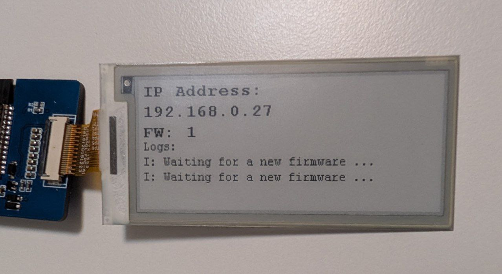

| Supported Targets | ESP32 | ESP32-C2 | ESP32-C3 | ESP32-C5 | ESP32-C6 | ESP32-C61 | ESP32-P4 | ESP32-S2 | ESP32-S3 |
| ----------------- | ----- | -------- | -------- | -------- | -------- | --------- | -------- | -------- | -------- |

# Native OTA example

This example is based on `app_update` component's APIs.

## Compatible hardware

[Waveshare 2.9 inch EPD](https://www.waveshare.com/wiki/2.9inch_e-Paper_Module)
[Waveshare ESP32 EPD board](https://www.waveshare.com/wiki/E-Paper_ESP32_Driver_Board)

## Configuration

Refer the README.md in the parent directory for the setup details.

## EPD Driver Source  
The EPD driver was adapted from:  
[krzychb/esp-epaper-29-ws](https://github.com/krzychb/esp-epaper-29-ws)  

## Server 
A local server can be started from the server/server.py

## To-Do  
- **Enable partial refresh**  
  Enable partial refresh for faster log display, currently limited at 10s per frame
- **Add reboot button**  
  Using a physical or web UI button to trigger a reboot after a successful upgrade

